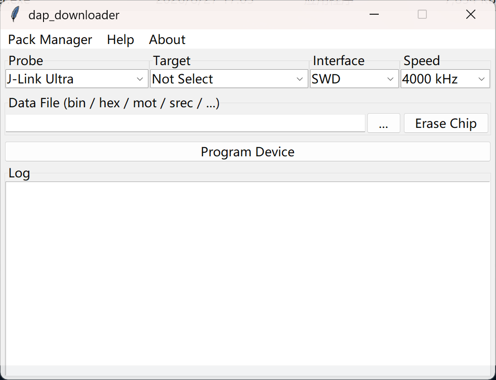

# dap_downloader

<div align="center">

基于 Tkinter + pyOCD 的可视化 MCU 烧录工具

**中文** | [English](./README.en.md)

<br>



</div>

## 致谢

- **[pyOCD](https://github.com/pyocd/pyOCD)**：开源 MCU 调试与下载库，基本支持所有芯片。
- **[pygubu](https://github.com/alejandroautalan/pygubu)**：易用的 Tkinter GUI 设计器（本项目已不再使用）。感谢它在无 AI 时代帮助初学者。
- **[DeepSeek](https://www.deepseek.com/)**：本项目开发中的 AI 助手。

## 功能

- 支持 pyOCD 支持的各种调试器
- 内置算法 + 自装 CMSIS-Pack 芯片
- SWD / JTAG，频率可调
- 支持 bin / hex / elf / srec，全片擦除
- 集成 Pack 管理器
- 支持拖放导入

## 使用

```cmd
python -m venv venv
venv\Scripts\activate
pip install -r packaging\requirements.txt
```

```cmd
python src\dap_downloader.py
```

打包（目录模式）：

```cmd
pyinstaller packaging\dap_downloader.spec
```

**烧录**：选探针 → 选芯片 → 选固件（bin 需设地址）→ 选接口与速度 → Program Device。

**擦除**：选芯片 → Erase Chip → 确认。

Pack 管理与拖放均在界面内完成。

> J-Link 驱动建议 ≤ 9.12。
